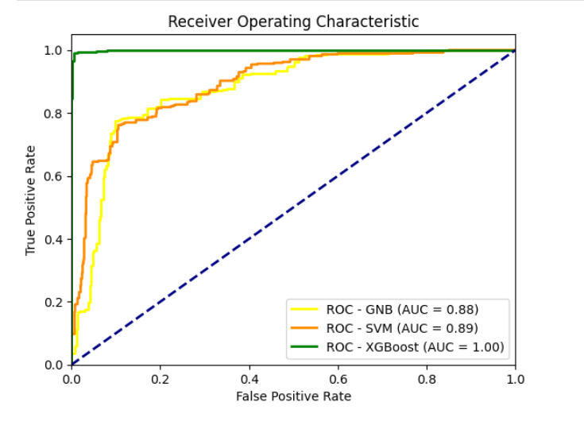

# Heart Failure Event Predictor 🫀



## 📌 Project Overview
Cardiovascular diseases are the number one cause of death globally. This project aims to predict the likelihood of death due to heart failure using a dataset of 12 clinical features. 

By implementing and comparing three distinct machine learning algorithms—**Gaussian Naive Bayes**, **Support Vector Machine (SVM)**, and **XGBoost**—this analysis identifies the most effective model for early detection and risk assessment.

## 📂 Dataset
The dataset contains clinical records for 5,000 patients (synthetic or augmented based on the UCI source).
* **Source:** [UCI Machine Learning Repository - Heart Failure Clinical Records](https://doi.org/10.24432/C5Z89R)
* **Target Variable:** `death_event` (0 = Survived, 1 = Deceased)
* **Key Features:** Age, Ejection Fraction, Serum Creatinine, Serum Sodium, etc.

## 🛠️ Workflow
1.  **Exploratory Data Analysis (EDA):**
    * Analyzed distributions of continuous variables (e.g., age, platelets) using histograms.
    * Visualized categorical variables (e.g., diabetes, smoking) using bar plots.
2.  **Data Preprocessing:**
    * Handled missing values.
    * Standardized continuous features using `StandardScaler` to optimize model performance.
    * Split data into 75% training and 25% testing sets.
3.  **Model Training:**
    * **Gaussian Naive Bayes:** A probabilistic baseline model.
    * **SVM (Linear Kernel):** A robust classifier for high-dimensional spaces.
    * **XGBoost:** An advanced gradient boosting ensemble method.
4.  **Evaluation:**
    * Used Classification Reports (Precision, Recall, F1-Score).
    * Calculated AUC scores and plotted ROC curves to compare model sensitivity.

## 📊 Key Results

| Model | Accuracy | AUC Score | Summary |
| :--- | :--- | :--- | :--- |
| **Gaussian Naive Bayes** | 80% | 0.88 | Good baseline performance; high recall for the negative class. |
| **SVM** | 85% | 0.89 | Improved accuracy and balance between precision/recall. |
| **XGBoost** | **99%** | **1.00** | Superior performance with near-perfect classification capabilities. |

As shown in the ROC Curve above, **XGBoost** significantly outperformed the other models, making it the ideal candidate for this predictive task.

## 💻 Technologies Used
* **Python**
* **Pandas & NumPy:** Data manipulation.
* **Matplotlib:** Data visualization.
* **Scikit-learn:** Preprocessing, model training (GNB, SVM), and evaluation metrics.
* **XGBoost:** Gradient boosting library.

## 🚀 How to Run
1.  Clone the repository.
2.  Install the required dependencies:
    ```bash
    pip install pandas numpy matplotlib scikit-learn xgboost
    ```
3.  Run the Jupyter Notebook:
    ```bash
    jupyter notebook "Heart Failure Event Predictor.ipynb"
    ```
